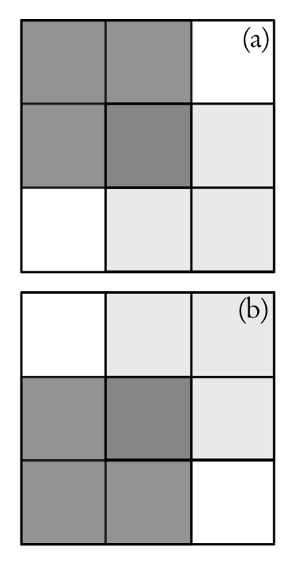

# Hilbert - Margolus Cellular Automata Engine
## Applying Hilbert-curve matrix optimizations on modified Margolus neighborhoods
### Abstract
### Introduction

#### Margolus Neighborhoods for Cellular Automata
In traditional cellular automata, the future state of a cell is a function of its 'neighborhood', a set of cells that itself is a function of the target cell. A margolus neighborhood changes this. Instead, it defines 'blocks'. These blocks contain cells, and every iteration they shift (See fig [1](#resources)) to change the cells that are grouped within blocks. The future state of a cell is determined by the future state of the block it resides in within that iteration. 

 

#### Hilbert curves for 2D cache-locality within 1D arrays 
A hilbert curve

### Resources
[1]: [Cache-oblivious Hilbert Curve-based Blocking Scheme for Matrix Transposition](https://dl.acm.org/doi/epdf/10.1145/3555353)
[2]: [Probabilistic Cellular Automata for Granular Media in Video Games](https://arxiv.org/pdf/2008.06341)
